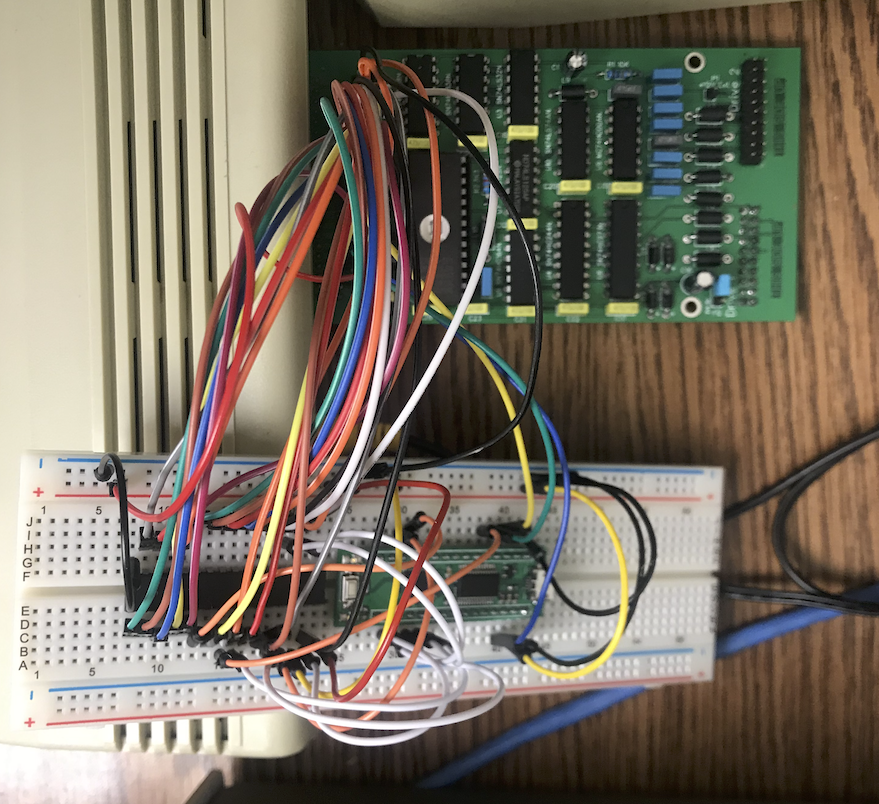

# Vtech Laser 310 64K memory extension

CPLD: pldKit XK2C95XL XILINX CPLD board

## laser310_64k

Port 70-7F for bank switching  
 
## No banking 64k

no_banking_64k is the first implemention with no banking support.  

## User constraint file

laser310_64k.ucf
